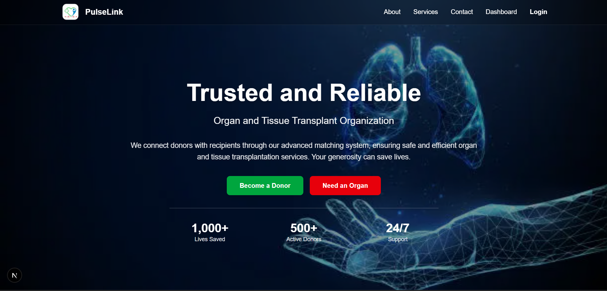

#  PulseLink - Real-Time Organ Matching & Emergency Transport Coordination System

## Table of Contents

- [Overview](#overview)
- [Tech Stack](#tech-stack)
- [Features](#features)
- [User Roles](#user-roles)
- [Project Structure](#project-structure)
- [Getting Started](#getting-started)
  - [Frontend](#frontend)
  - [Backend](#backend)
- [Backend Service](#backend-service)
- [License](#license)

---

## Overview

PulseLink connects donor hospitals, transplant centers, and emergency services in real time to streamline the organ matching process and coordinate emergency transport. With a modern and responsive interface, the platform enables fast decisions and data-driven collaboration, ultimately helping to save lives.



---

## Tech Stack

- **Frontend:** Next.js (App Router), TypeScript, Tailwind CSS
- **Backend:** Ballerina (developed separately)
- **API Communication:** REST (planned)
- **Additional Tools:** React Hook Form, Zustand/Redux (optional), Google Maps API, SMS Gateway (Twilio or equivalent)

---

## Features

- **Modern UI:** Glassmorphism, dark theme, responsive design
- **Authentication:** Secure login and signup with role-based access (admin/user)
- **Profile Management:** Editable profiles with hospital-specific details
- **Real-Time Matching:** Dynamic donor and recipient organ matching (planned)
- **Emergency Coordination:** Dashboard for transport and logistics (planned)
- **Live Stats:** Animated counters and statistics for donations and matches
- **Custom Error Pages:** Branded 404 and error handling interfaces
- **Smooth Navigation:** Sticky/floating navbar, profile dropdown, and seamless routing

---

## User Roles

- **Admin:** Manage dashboard, hospitals, and view all matches
- **Hospital/User:** Register, manage profile, view matches, and request transport

---

## Project Structure

```
PulseLink/
├── frontend/
│   ├── public/
│   │   ├── logo.png
│   │   └── hero.png
│   ├── components/
│   │   ├── Navbar.tsx
│   │   └── Footer.tsx
│   ├── src/
│   │   └── app/
│   │       ├── page.tsx
│   │       └── (auth)/
│   │           ├── login/page.tsx
│   │           └── signup/page.tsx
│   ├── package.json
│   └── tsconfig.json
├── backend/
│   ├── Ballerina.toml
│   ├── service.bal
│   └── tests/
│       └── service_test.bal
└── README.md
```

---

## Getting Started

### Frontend

**Prerequisites:**

- Node.js (v16 or higher)
- npm or yarn

**Installation & Running:**

1. Clone the repository:
   ```bash
   git clone https://github.com/PathumiRanasinghe/iwb25-469-pulselink.git
   cd PulseLink
   ```
2. Install frontend dependencies and start the development server:
   ```bash
   cd frontend
   npm install
   npm run dev
   ```
3. Open your browser at [http://localhost:3000](http://localhost:3000).

---

### Backend

**Prerequisites:**

- Ballerina 2201.12.7 or higher
- MongoDB Atlas account (or a local MongoDB instance)

**Configuration & Running:**

1. Create a `Config.toml` file in the project root with your MongoDB connection string.
   > Important: Do not commit your `Config.toml` file to version control.
2. Run the backend service:
   ```bash
   bal run
   ```
   The server will start on port 9090.

---

## License

Copyright © 2025 PulseLink - Saving lives through technology.

---

